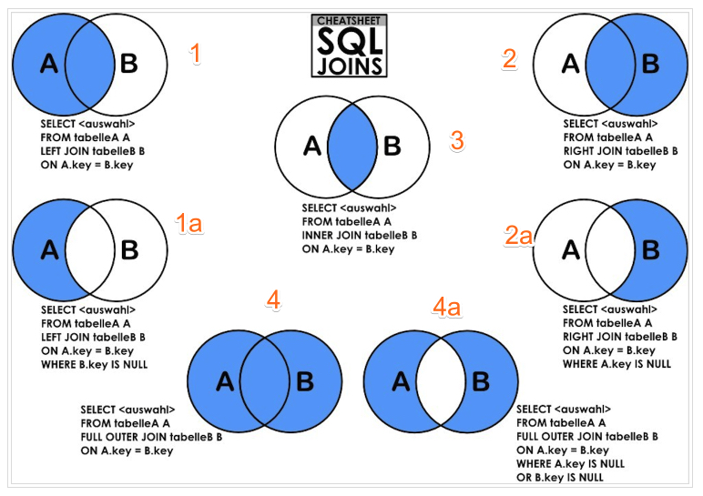
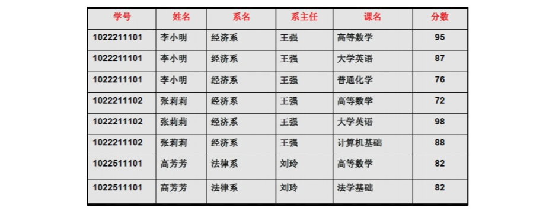
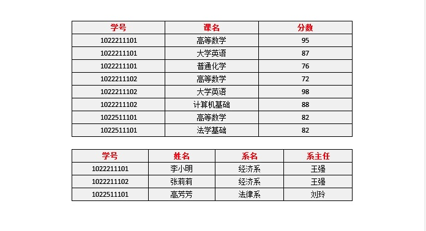
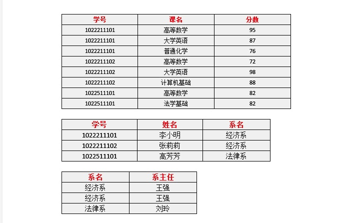

<style>
img {
    margin:auto;
    width:100%;
}
</style>
### 目录索引
[ InnerJoin](#inner-join)        
[ LeftJoin](#leftjoin)       
[ RightJoin](#rightjoin)      
[ Union](#union)        
[ UnionAll](#unionall)       
[ Having](#having)
[ 三范式](#三范式)


#### 图解Join


#### inner join
- `usage` :
    ```
    SELECT column_name(s)
    FROM table1
    JOIN table2
    ON table1.column_name=table2.column_name AND table1.column_name>0;
    ```
- `description` : `inner join` 即`join`该语法会将两个表中关联的交集行返回，若右表不存在相应的值，则左表不会列出改行，结果表中既含左表也含右表的列。
- `remarks` : 可在语句后使用 `AND 子句`将结果进行过滤

#### LeftJoin
- `usage` :
    ```
    SELECT column_name(s)
    FROM table1
    LEFT JOIN table2
    ON table1.column_name=table2.column_name AND table1.column_name>0;
    ```
- `description` : `LEFT JOIN` 关键字**从左表（table1）返回所有的行**，即使右表（`table2`）中没有匹配。如果右表中没有匹配，则结果为 `NULL`。结果表中既含左表也含右表的列。
- `remarks` : 

#### RightJoin
- `usage` :
- `description` : `RIGHT JOIN` 关键字**从右表（table2）返回所有的行**，即使左表（`table1`）中没有匹配。如果左表中没有匹配，则结果为 `NULL`。结果表中既含左表也含右表的列。
- `remarks` : 

#### Union
- `usage` :
    ```
    SELECT column_name(s) FROM table1
    UNION
    SELECT column_name(s) FROM table2;
    ```
- `description` : SQL UNION 操作符合并两个或多个 SELECT 语句的结果。会过滤重复的列值。
- `remarks` : 

#### UnionAll
- `usage` :
- `description` : SQL UNION 操作符合并两个或多个 SELECT 语句的结果。不会过滤重复的列值。
- `remarks` : 

#### GroupBy
- `usage` :
- `description` : 将结果集按照某个字段分成组，每个组含有若干条记录，可以使用聚合函数一起使用，如`SUM`，`AVG`，`MAX`，`MIN`和`COUNT`。SELECT子句中使用聚合函数来计算有关每个分组的信息。
- `remarks` : 可使用`having子句`写在`group by子句`后对结果进行过滤

#### Having
- `usage` : 
- `description` : HAVING子句通常与GROUP BY子句一起使用，以根据指定的条件过滤分组。如果省略GROUP BY子句，则HAVING子句的行为与WHERE子句类似。
- `remarks` : 

#### 三范式

- Define
```
码：关系中的某个属性或者某几个属性的组合，用于区分每个元组（可以把“元组”理解为一张表中的每条记录，也就是每一行）。
函数依赖: 我们可以这么理解（但并不是特别严格的定义）：若在一张表中，在属性（或属性组）X的值确定的情况下，必定能确定属性Y的值，那么就可以说Y函数依赖于X，写作 X → Y。也就是说，在数据表中，不存在任意两条记录，它们在X属性（或属性组）上的值相同，而在Y属性上的值不同。这也就是“函数依赖”名字的由来，类似于函数关系 y = f(x)，在x的值确定的情况下，y的值一定是确定的。


```

- 1NF 字段不可分;   
    - `description` : 原子性，字段不可再分    
    - `example`:（正例如：姓名,年龄,电话；反例如：地区-> xx省xx市xxx区）  
    - `remarks`:   
    - `result`:
    ```
    1. 存在数据冗余过大:每一名学生的学号、姓名、系名、系主任这些数据重复多次。每个系与对应的系主任的数据也重复多次——数据冗余过大
    2. 插入异常:假如学校新建了一个系，但是暂时还没有招收任何学生（比如3月份就新建了，但要等到8月份才招生），那么是无法将系名与系主任的数据单独地添加到数据表中去的 （注１）——插入异常注１：根据三种关系完整性约束中实体完整性的要求，关系中的码所包含的任意一个属性都不能为空，所有属性的组合也不能重复。为了满足此要求，图中的表，只能将学号与课名的组合作为码，否则就无法唯一地区分每一条记录
    3. 删除异常:假如将某个系中所有学生相关的记录都删除，那么所有系与系主任的数据也就随之消失了（一个系所有学生都没有了，并不表示这个系就没有了）。——删除异常
    4. 修改异常的问题:假如李小明转系到法律系，那么为了保证数据库中数据的一致性，需要修改三条记录中系与系主任的数据。——修改异常。
    ```
    
为了符合2NF的要求，我们必须消除这些部分函数依赖，只有一个办法，就是将大数据表拆分成两个或者更多个更小的数据表，在拆分的过程中，要达到更高一级范式的要求，这个过程叫做”模式分解“。

- 2NF:有主键，非主键字段依赖主键;   
    - `description` : 唯一性，一张表值说明一个事物    
    - `example`:  
    - `remarks`:  
    - `result` : 
    ```
    1. 李小明转系到法律系只需要修改一次李小明对应的系的值即可。——有改进数据冗余是否减少了？学生的姓名、系名与系主任，不再像之前一样重复那么多次了。——有改进
    2. 删除某个系中所有的学生记录该系的信息仍然全部丢失。——无改进
    3. 插入一个尚无学生的新系的信息。因为学生表的码是学号，不能为空，所以此操作不被允许。——无改进
    ```

    
- 3NF:非主键字段不能相互依赖;3NF在2NF的基础之上，消除了非主属性对于码的传递函数依赖。也就是说，如果存在非主属性对于码的传递函数依赖，则不符合3NF的要求。
    - `description` : 唯一性，一张表值说明一个事物    
    - `example`:  
    - `remarks`:  
    - `result` : 
    ```
    1. 删除某个系中所有的学生记录该系的信息不会丢失。——有改进
    2. 插入一个尚无学生的新系的信息。因为系表与学生表目前是独立的两张表，所以不影响。——有改进
    3. 数据冗余更加少了。——有改进
    ```


[返回顶部](#目录索引)

### 参考文章
[知乎@知乎用户  #如何解释关系数据库的第一第二第三范式?#](https://www.zhihu.com/question/24696366)